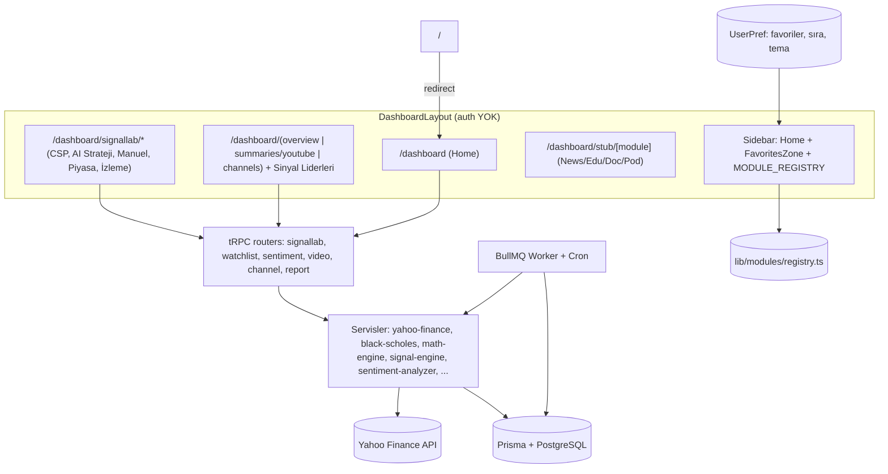

# Tasarım Dokümanı: One-Stop-Fin (v1)

## 1. Genel Bakış (Overview)

One-Stop-Fin, tek kullanıcılı ve tamamen lokal çalışan kişisel bir finans karar-destek terminali. Mevcut `finsumy` reposu zaten istenen modüler mimarinin (registry-tabanlı sidebar, FinSumy + SignalLab modülleri, çalışan TS servisleri) çoğunu içeriyor; bu yüzden v1 sıfırdan yazım değil, **fork-and-strip** üzerine kuruludur: değerli kod yeni `One-Stop-Fin` reposuna taşınır, EGA + SaaS + çok-kullanıcılı auth + pazarlama yüzeyleri atılır, veri katmanı buluttan lokale çekilir.

Üç temel karar:
1. **Tek kullanıcı, auth yok.** Uygulama launcher arkasında `localhost`'ta çalışır; `/` doğrudan `/dashboard`'a yönlenir. Giriş/abonelik/çok-kiracılık tamamen kaldırılır.
2. **Lokal veri.** Supabase yerine Docker'da PostgreSQL + Prisma. Servislerdeki `SupabaseClient` bağımlılığı Prisma'ya çevrilir — v1'in tek ciddi refactor'ü budur.
3. **Büyüyen sol menü.** Sidebar `MODULE_REGISTRY`'den render edilir; en üstte Home, hemen altında sürükle-bırak ile özelleştirilebilir bir **Favoriler** bölgesi, sonra değişmez modül listesi.

Görünüm Seeking Alpha esinli: koyu dar sidebar, turuncu vurgu, beyaz/açık-gri yoğun kart düzeni, modern sans tipografi.

## 2. Mimari (Architecture)

### 2.1 Katmanlar

Sunum katmanı (Next.js App Router + tRPC client) ile veri katmanı (tRPC server + servisler + Prisma + BullMQ) ayrılır. FinSumy ingestion'ı arka planda (cron + worker) sürer; sayfalar yalnız store/servisten okur.



### 2.2 Çalışma zamanı

`docker-compose` üç servis: `web` (Next.js, port 3000), `postgres` (5432), `redis` (6379). Worker, `web` imajı içinde ayrı bir process (veya ayrı `worker` servisi) olarak BullMQ kuyruğunu ve cron'ları işler. Launcher bu stack'i ayağa kaldırır.

## 3. Repo Yapısı

```
One-Stop-Fin/
├─ docker-compose.yml
├─ Dockerfile
├─ launcher/                 # .app içine girecek shell betiği + README + icon
│  └─ one-stop-fin.command
├─ prisma/
│  ├─ schema.prisma
│  └─ seed.ts
├─ messages/tr.json
├─ src/
│  ├─ app/
│  │  ├─ page.tsx            # → redirect /dashboard
│  │  ├─ dashboard/
│  │  │  ├─ layout.tsx       # Sidebar + Home/Favorites
│  │  │  ├─ page.tsx         # Home (özet panosu)
│  │  │  ├─ signallab/{csp-screener,ai-strategy,manual,market-overview,watchlist}/page.tsx
│  │  │  ├─ overview/page.tsx, summaries/youtube/page.tsx, channels/page.tsx
│  │  │  └─ stub/[module]/page.tsx
│  │  └─ api/{health,trpc/[trpc],cron/*}/route.ts
│  ├─ lib/{db.ts, modules/registry.ts, trpc/*, sidebar/persistence.ts}
│  ├─ server/{trpc.ts, root.ts, routers/*, services/{yahoo-finance,black-scholes,math-engine}}
│  ├─ services/{signal-engine, sentiment-analyzer, ...}
│  └─ components/{ui/*, dashboard/*, sidebar/*, home/*}
```

## 4. Veri Katmanı Geçişi (Supabase → Prisma)

Bu v1'in en kritik teknik işidir. Taşınan servislerin imzaları `(supabase: SupabaseClient, ...)` yerine `(db: PrismaClient, ...)` olur; sorgular eşdeğer Prisma çağrılarına çevrilir.

| Source (Supabase) | One-Stop-Fin (Prisma) |
|---|---|
| `supabase.from("videos").select()` | `db.video.findMany()` |
| `supabase.from("video_key_points")...` | `db.videoKeyPoint.findMany()` |
| `supabase.from("channels")...` | `db.channel.*` |
| watchlist tabloları | `db.watchlistItem.*` |
| daily reports | `db.dailyReport.*` |

`signal-engine`, `sentiment-analyzer`, `watchlist-service`, `channel-manager`, `video-*`, `report-generator` ve `digest` router'ı bu geçişten etkilenir. SignalLab'ın Yahoo'dan canlı besleyen sayfaları (CSP, AI Strateji, Manuel, market-overview) DB'ye dokunmadığı için geçişten etkilenmez — bu yüzden onlar erken taşınır.

Prisma şeması (özet): `Channel`, `Video`, `VideoKeyPoint`, `StockMention`, `TickerSignal`, `WatchlistItem`, `DailyReport`, `UserPref(id, favorites Json, theme, sidebarState Json)`.

## 5. Tasarım Token'ları (Seeking Alpha esinli)

Tailwind teması + CSS değişkenleri:

```
sidebar.bg      #16181c     accent          #ff6b00
sidebar.fg      #c9ccd1     accent.hover    #ff8c3a
page.bg         #f6f7f9     link            #2b6cb0
card.bg         #ffffff     up              #15803d
card.border     #e3e5e8     down            #dc2626
text.primary    #1a1d21     text.muted      #6b7280
```

- Yazı tipi: Inter (veya benzeri modern sans), gövde 13–14px, başlık 15–17px/500.
- Kart: beyaz zemin, 0.5px kenarlık, `rounded-lg`, padding 12px; başlık + "Detay →" linki (mavi); yoğun satır düzeni.
- Aktif sidebar öğesi: 3px turuncu sol bar + hafif beyaz overlay.
- Koyu tema isteğe bağlı; tercih `UserPref.theme`'de.

## 6. Shell (DashboardLayout)

Auth guard yok. Layout = Sidebar + içerik alanı. `/` → `redirect("/dashboard")`. Sidebar üç bölge: (1) sabit Home linki, (2) FavoritesZone, (3) `MODULE_REGISTRY` modül listesi.

## 7. Sidebar ve Favoriler bölgesi

Sidebar tamamen `MODULE_REGISTRY`'den render edilir (Req 5). Modül öğeleri `@dnd-kit` ile "draggable" kaynak; FavoritesZone bir "droppable" + `SortableContext` hedefidir.

## 8. Home (özet panosu)

Üstte indeks/ticker şeridi; altında `grid` SummaryCard ızgarası. Kartlar ve besleyen procedure'lar:

| SummaryCard | Veri | Detay rotası |
|---|---|---|
| Piyasa Sinyalleri | `signallab.aiPick` sinyalleri / market-overview | `/dashboard/signallab/market-overview` |
| Sinyal Liderleri | `signal-engine` ticker skorları | `/dashboard/overview` |
| CSP Tarayıcı (bugün) | `signallab.cspScreener` | `/dashboard/signallab/csp-screener` |
| Son Video Özetleri | `video` router | `/dashboard/summaries/youtube` |
| Earnings | `signallab` earnings / yahoo | `/dashboard/signallab` |
| İzleme Listesi | `watchlist` router | `/dashboard/signallab/watchlist` |

Her kart yükleniyor/boş/hata durumlarını ele alır; round'lanmış sayılar gösterir.

## 9. Favoriler — veri modeli ve etkileşim

- Model: `UserPref.favorites: FavoriteItem[]` (`{ href, labelKey, order }`).
- Sürükle-bırak: modül menüsünden öğe → FavoritesZone'a bırakılınca `favorites`'a eklenir (varsa eklenmez, Req 8.5). Bölge içinde `@dnd-kit/sortable` ile sıralama; sürükleyip dışarı atınca kaldırılır.
- Kalıcılık: değişiklikte `userPref.upsert` ile DB'ye yazılır; ilk yüklemede DB'den okunur. (İlk iterasyonda localStorage ile başlatılıp DB'ye taşınması da kabul edilebilir.)

## 10. SignalLab Modülü (v1)

Source repo'daki sayfalar + `signallab` router + `yahoo-finance/black-scholes/math-engine` servisleri taşınır. v1 zorunlu: CSP Tarayıcı (en büyük; `OZAN_TICKERS` korunur), AI Strateji (`signallab.aiPick`), Manuel Analiz, market-overview, İzleme Listesi. Earnings/Sektör/Takvim/Unusual registry'de kalır, v1.1.

## 11. FinSumy Modülü (v1)

Sayfalar: Genel Bakış (overview), YouTube Özetleri, Kanallar, Sinyal Liderleri/heatmap. Hat: `transcript-engine → sentiment-analyzer → investment-analyzer → signal-engine`, hepsi Prisma'ya bağlanır. Tarama + günlük rapor BullMQ cron'ları olarak `worker`'da çalışır.

## 12. Launcher

`launcher/one-stop-fin.command`:

```bash
#!/bin/bash
cd "$(dirname "$0")/.."
open -a Docker
until docker info >/dev/null 2>&1; do sleep 1; done
docker compose up -d
until curl -sf http://localhost:3000/api/health >/dev/null; do sleep 1; done
open -na "Google Chrome" --args --app=http://localhost:3000
```

README adımları: Automator → New Application → Run Shell Script (yukarıdaki içerik) → kaydet → Get Info'dan özel `.icns` ikon → masaüstüne taşı. Native uygulama yok (Req 11.5).

## 13. Kararlar (Decisions)

1. **Sıfırdan repo + fork-and-strip** (sıfırdan yazım değil): çalışan beyin korunur, yük atılır.
2. **PostgreSQL (SQLite değil)**: source servisler Supabase/Postgres semantiğine yazılı; Postgres geçişi en az sürtünmeli.
3. **Auth yok**: lokal + tek kullanıcı; launcher tek erişim noktası.
4. **Favoriler kalıcılığı DB'de** (UserPref): launcher'lar arası tutarlı; ileride cihaz başına ayar gerekmez.
5. **v1 dışı**: stub modüller, FinSumy reports/podcasts/rss, çok-kullanıcılık, bulut.
